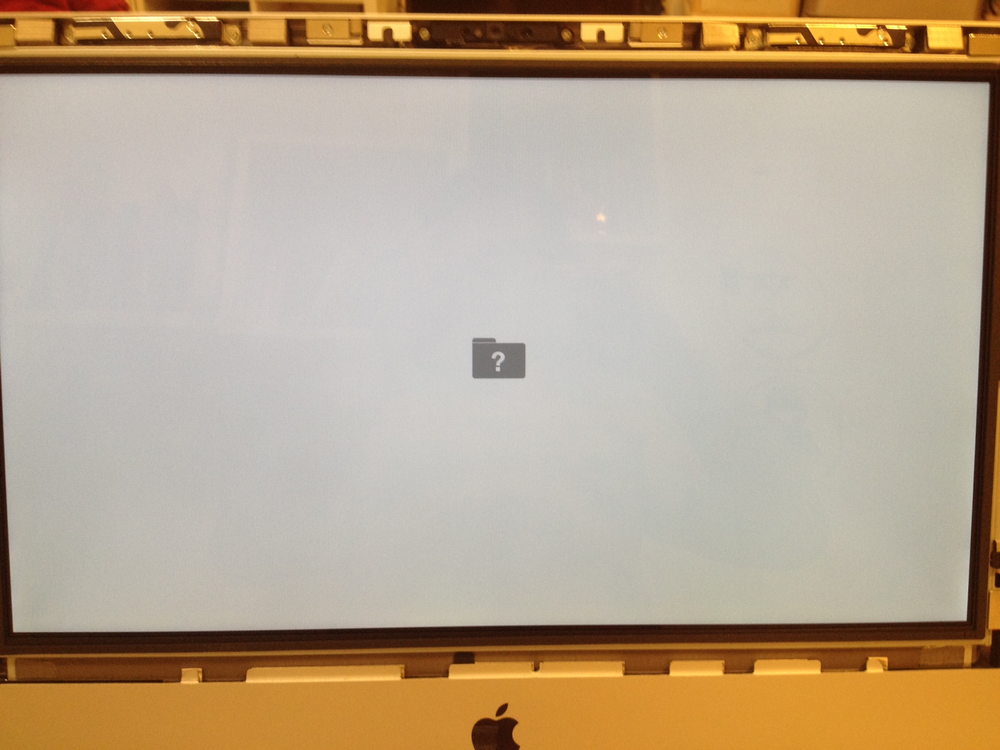

# 取下 HDD 換上 SSD(OWC)

## 環境

- iMac 2011 mid 21"
- 240G SSD, OWC
- [購買網頁](http://eshop.macsales.com/item/OWC/KITIM11HE240/)
- [教學影片](http://eshop.macsales.com/installvideos/imac_mid_2011_hd/)

## 先前準備

- 先將 ssd 格式化
	- 將 ssd 放入 2.5" 外接硬碟盒中，插入 mac 電腦
	- 系統會提示，此硬碟無法讀取，詢問是否修改
	- 開啟『磁碟工具程式』
	- 選擇清除
	- 『Mac OS 擴充格式』、『GUID 磁碟分割區表格』
- 將 HDD 更換為 SSD 後
	- Power On 後 按 【Command】+ 【Option】+【P】+【R】，在聽到第二聲鐺後，可看到電腦又重新開機
	- 此時，按 【Command】+ 【R】，從 Internet 進行 Recovery
	- 可選擇『回復』、『重新安裝作業系統』

