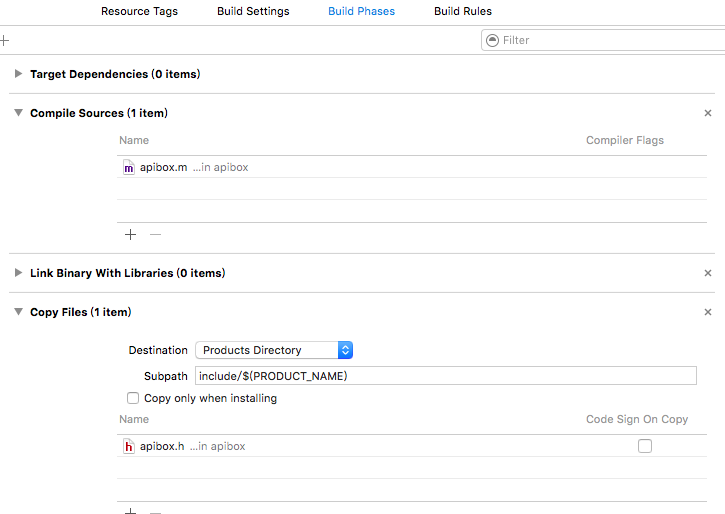

## source

[官方：Introduction to Using Static Libraries in iOS](https://developer.apple.com/library/ios/technotes/iOSStaticLibraries/Introduction.html#//apple_ref/doc/uid/TP40012554-CH1-SW1)

## 在 workspace 建立 static lib 關聯

### 環境
- xcode 7.2.1
- ios 9.2

### github
[sample](https://github.com/jhaoheng/objc_staticLib_demo)

### 教學
1. 建立一個 workspace
2. 建立一個 project : project(名稱)
3. 建立一個 static lib : apibox(名稱)
4. 在 project 中
	- Build Settings -> User Header Search Paths -> 新增 `$(BUILT_PRODUCTS_DIR)`，並選擇 recursive
	- Build Phases -> Link Binary With Libraries -> 新增 libapibox.a
5. 在 apibox 中
	- Build Settings -> Other Linker Flags -> 確認加入 `-Objc`、`-all_load`、`-force_load`
6. 編輯 project 的 scheme
	- 在 scheme(project) -> Build -> 新增 apibox(將之拖曳到最上方)

### 觀察 static lib

	
### troubleshooting

- How do I fix "selector not recognized" runtime exceptions when trying to use category methods from a static library?
	- [answer](https://developer.apple.com/library/mac/qa/qa1490/_index.html)