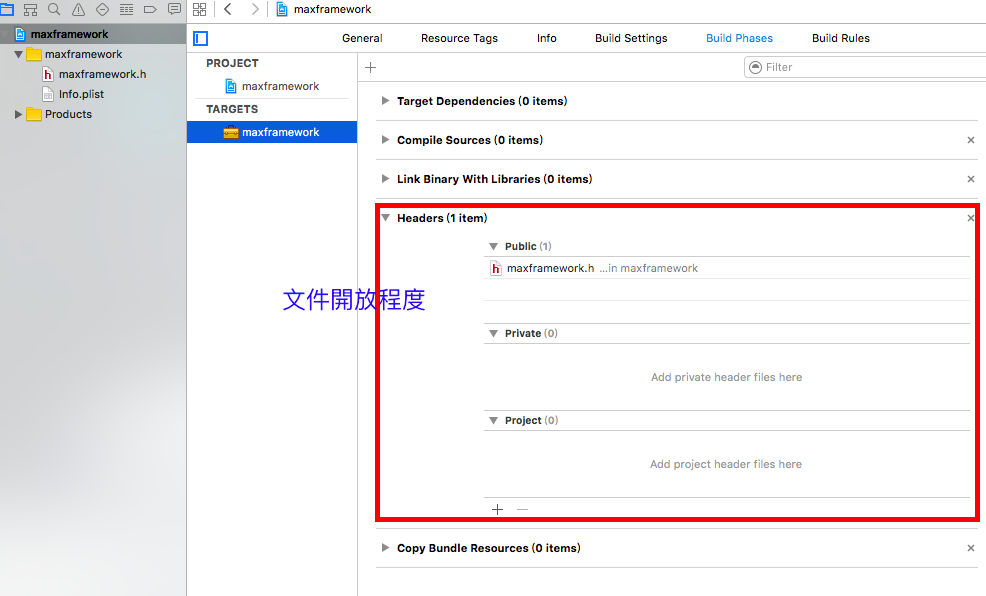

# framework

## Why

直接在 xcode 中，產生出適合 `armv7 -arch armv7s` 與 `x86_64` 的 framework
若透過預設的方法產出，會有兩種版本，必須再使用 `lipo create` 進行合併

## How

1. open xcode and select [Framework & Library] -> [Cocoa Touch Framework]



2. Build Phases
	- Target Dependencies
	- [Compile Sources](http://stackoverflow.com/questions/17198185/what-is-the-purpose-of-compile-sources-in-xcode)
	- [Link Binary With Library](https://developer.apple.com/library/ios/recipes/xcode_help-project_editor/Articles/AddingaLibrarytoaTarget.html)
		- 連接使用其他 framework
	- Headers
		- 讓 framework 中的檔案開放程度
	- Copy Bundle Resources
		- 要使用的 bundle 物件檔

3. 新增 target
	- 選擇 [other] -> [Aggregate]
	- 於剛剛建立好的 aggregate 中，新增 [Run Script Phase]
	- 在 shell 腳本中寫入
		```
		# Sets the target folders and the final framework product.
		# 如果工程名稱和 Framework 的 Target 名稱不一樣的話，要自定義 Framework name
		# 例如: FMK_NAME = "MyFramework"
		FMK_NAME=${PROJECT_NAME}
		
		# Install dir will be the final output to the framework.
		# The following line create it in the root folder of the current project.
		INSTALL_DIR=${SRCROOT}/Products/${FMK_NAME}.framework
		
		# Working dir will be deleted after the framework creation.
		WRK_DIR=build
		DEVICE_DIR=${WRK_DIR}/Release-iphoneos/${FMK_NAME}.framework
		SIMULATOR_DIR=${WRK_DIR}/Release-iphonesimulator/${FMK_NAME}.framework
		
		# -configuration ${CONFIGURATION}
		# Clean and Building both architectures.
		xcodebuild -configuration "Release" -target "${FMK_NAME}" -sdk iphoneos -arch armv7 -arch armv7s -arch arm64 clean build
		xcodebuild -configuration "Release" -target "${FMK_NAME}" -sdk iphonesimulator -arch x86_64 clean build
		# Cleaning the oldest.
		if [ -d "${INSTALL_DIR}" ]
		then
		rm -rf "${INSTALL_DIR}"
		fi
		mkdir -p "${INSTALL_DIR}"
		cp -R "${DEVICE_DIR}/" "${INSTALL_DIR}/"
		
		# Uses the Lipo Tool to merge both binary files (i386 + armv6/armv7) into one Universal final product.
		lipo -create "${DEVICE_DIR}/${FMK_NAME}" "${SIMULATOR_DIR}/${FMK_NAME}" -output "${INSTALL_DIR}/${FMK_NAME}"
		rm -r "${WRK_DIR}"
		open "${SRCROOT}/Products/"
		```
	- 檢查支援的架構，注意指向 framework 內部 
		- `lipo -info path/xxx.framework/xxx`，xxx is your frmaework's name