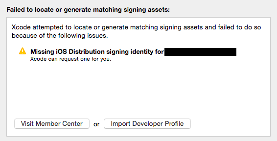

## 在『鑰匙圈』中，apple 的開發者憑證顯示紅燈『憑證簽署人無效』

20160216 發生 archive 後，無法 export .ipa file.  系統顯示  

> Missing iOS Developer signing identity for xxxxxxxxx  
> Xcode can request one for you

[stackoverflow](http://stackoverflow.com/questions/35404953/failed-to-locate-or-generate-matching-singing-assets-xcode-7-2-1)

此時只要到『鑰匙圈』中查看 apple 發的開發者憑證，發現亮紅燈，顯示 **『憑證簽署人無效』**  

此時做了 
 
1. 刪除掉所有憑證，重新建立此台電腦的憑證，並上傳到 apple developer center，重新產生開發者憑證 -> **無效**
2. 重新設定該憑證的 mail，重新上傳 -> **無效**
3. 重新安裝 AppleWWDRCA.cer -> **無效**
4. 透過 xcode 7 的功能，自動產生簽署憑證 -> **無效**
5. 換另一個開發者帳號，重新建立憑證 -> **無效**
6. 重裝 xcode -> **無效**

[finish]

1. 進入鑰匙圈，在該 app 中的 navigation bar 中，點開 『顯示方式』->『顯示過期的憑證』，可發現過期的 AppleWWDRCA.cer
2. 因為舊的憑證沒刪除，會導致系統一直依據此張憑證，不會去看你新下載的 AppleWWDRCA.cer
3. 檢查『鑰匙圈』->『系統』/『登入』是否還存在過期的憑證
4. 如果此時沒有 AppleWWDRCA.cer，請看官網重新下載
5. 此時再看你的憑證，**『綠燈』**

