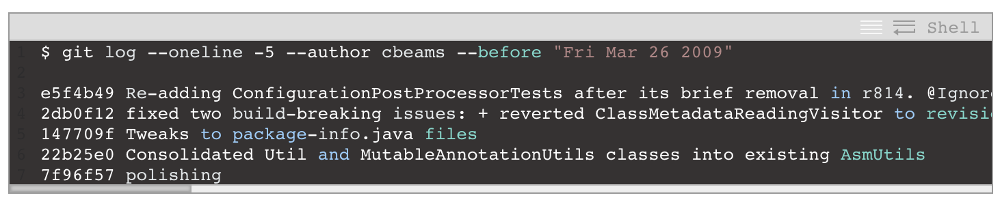
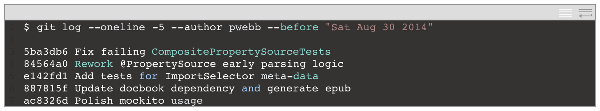
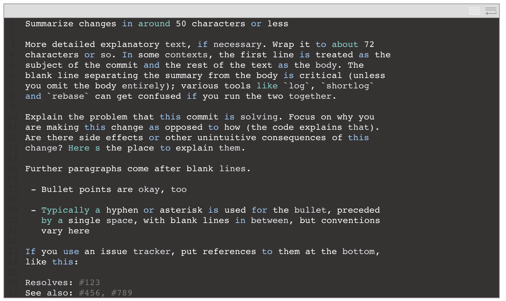

# 如何寫一個 Git Commit Message

> 英文原文：https://chris.beams.io/posts/git-commit/

## 導論：為什麼好的 commit message 很重要

如果你隨機挑一個 git repo 的 log 來閱讀，你大概會發現它的 commit message 是一團糟。舉個例子，看看這些我以前 committing 到 Spring 的 gems：

後來的 commit

- 前者無論是在長度或結構上都很糟；
- 後者則是簡明與一致的。
- 前者是大部份情況下會發生的事情，後者從不會偶然發生。
- 雖然大部分 repos 的 commit message 都跟前者差不多，但還是有例外的情況。可以參考 Linux kernel 以及 Git 本身，都是一個很好的範例。再看看 Spring Boot，或是任何由 Tim Pope 維護的 repos。

> 這些 repos 的貢獻者知道一個精心繕打的 Git commit message 是跟其他開發者 (以及未來的自己) 講解關於一個改變的脈絡 (communicate context about a change) 的最好方式。

- 一個 diff 可以告訴你什麼改變了，但是只有 commit message 可以正確的告訴你為什麼 。

> Peter Hutterer : 
> 重新建立一段程式碼的脈絡是非常浪費的事情。我們無法避免這件事情的複雜性，因此我們應將心力放在儘可能的降低複雜度。Commit messages 正可以做到這點，而我們可以從 commit message 看出一個開發者是不是一位好的合作對象。

- 如果你對於什麼樣的內容造就一個好的 Git commit message 沒有太多的想法，這大概是因為你沒有花很多時間使用 git log 以及相關的指令。這會產生一個糟糕的循環：
	- 因為 commit 歷史是不一致且沒有架構的，你就不會花時間使用它或是維護它。
	- 而因為它沒有被使用或是被維護，就會一直是不一致且沒有架構的狀況。
- 但是一個精心撰寫的 log 是漂亮以及有用的。
	- `git blame`、`revert`、`rebase`、`log`、`shortlog` 以及其他相關的指令會進入到你的生活中。
	- 檢閱其他人的 commits 以及 pull requests 變成一個值得去做的事情，並且變得可以獨立完成。我們因此變得能夠理解一件數個月前或數年前的事情。

> 一個專案是否能長期且成功的運作 (撇除其他影響的因素) 取決於它的可維護性，維護人員幾乎沒有比專案的 log 更強大的工具。
> 我們值得花時間學習如何正確的使用 log。一開始你可能會覺得麻煩，但它很快的就會變成一種習慣，甚至能成為自豪感以及生產力的來源。

在這篇文章中，我們只針對維護一個可靠的 commit history 中最簡單的一個要件來講解：如何撰寫一個獨立的 commit message。

# 偉大 Git commit message 的七條規則

1. 用一行空白行分隔標題與內容
2. 限制標題最多只有 50 字元
3. 標題開頭要大寫
4. 標題不以句點結尾
5. 以祈使句撰寫標題
6. 內文每行最多 72 字
7. 用內文解釋 what 以及 why vs. how

> ex:
> 

## 1. 用一行空白行分隔標題與內容
1. 不是所有的 commit message 都同時需要標題與內文。有時候一行文也很好
2. 使用 `git log --online` 來快速查看

## 2. 限制標題最多只有 50 字元
> 50字元的限制不是一個硬規則，而是一個經驗法則。
> 讓標題保持在 50 字以下能夠確保標題的可讀性，並且強迫作者思考如何用更簡潔的方式表達發生什麼事情。
> 如果你很難總結出標題，這代表你可能在一個 commit 裏面做了太多的改變。請儘量讓 commits 原子化 (atomic commits)。

1. 以 50 個字為目標，最多 72 個字為硬規則。

## 3. 標題開頭要大寫
1. 超簡單的規則，如同字面上的意思，任何標題的開頭都要大寫。

## 4. 標題不以句點結尾
1. 結尾的標點符號在標題列是多餘的。此外，當你要遵守 50 字或以下的規則時，字元空間是很寶貴的。

## 5. 以祈使句撰寫標題
1. 以命令的口氣來撰寫標題
2. ”使用祈使句” 規則只在標題是重要的。在撰寫內文時放寬這條規則。

## 6. 內文每行最多 72 字
## 7. 用內文解釋 what 以及 why vs. how

> ex : https://github.com/bitcoin/bitcoin/commit/eb0b56b19017ab5c16c745e6da39c53126924ed6
> 作者花了時間寫下其脈絡，可以讓未來的 committers 省下多少時間。如果他沒有這麼做，這件事情可能就會被埋末再裏面。