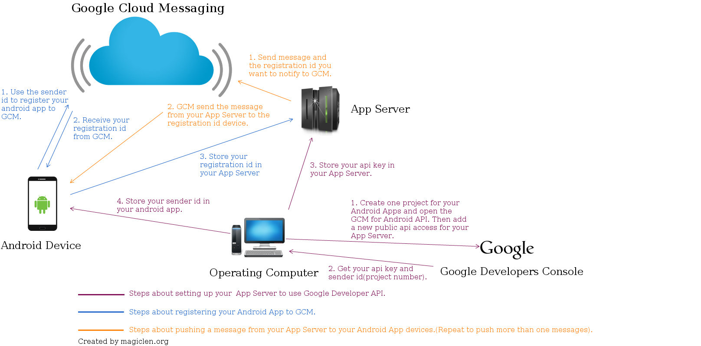

# google cloud messaging(GCM)

- 20160303
- Google Developers Console

## 運作機制

## 註冊 api key(紫色部分)

1. 是否已有專案

	- 無：先建立專案，才可以產生 api key
	- 有：直接進行第二步驟
	
2. 先到 [Google Developers Console](https://console.developers.google.com/project) 取得 API KEY

	- 進入專案後，『資訊主頁』->『使用 Google API』
	- 行動服務類 api -> [Google Cloud Messaging](https://console.developers.google.com/apis/api/googlecloudmessaging/overview?project=test2-1239)
	- `enable`
