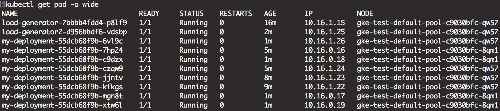

# 結論
> 同一個 node 底下, 其中的 pod 資源共享
> 在 hpa 下，新的 pod 會分散到不同的 node 上

# 測試方式
1. 建立 my-deployment, pod + service
2. 建立 hpa 設定低資源就建立, pod 上限設定多一些
3. 建立壓力器 : `kubectl run -i --tty load-generator --image=busybox /bin/sh`
	- 執行 `while true; do wget -q -O- http://<service-name>.default.svc.cluster.local; done`
4. 等待, 結果如下圖

