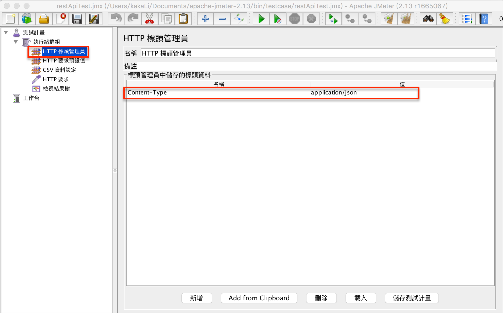

# JMeter 壓測Json Rest API

## 前言

收發json字串的Rest API愈來愈常用，本文將介紹如何用JMeter壓測及動態從CSV檔案取得不同Request資料。

## 目的

簡單作到壓測收發json字串的Rest API

## 開始前準備

先去下載JMeter
http://jmeter.apache.org/download_jmeter.cgi

此文使用JMeter 2.13版本

## 設定腳本注意事項

主要是HTTP 標頭管理員，需設定名稱和值

- 名稱：Content-Type
- 值：application/json

其實就是程式如用HttpClient呼叫json的Rest API也需有些設定

HTTP 要求  
因該呼叫的API需用post呼叫，故方法點選「POST」，切換至Body Data，填上Request的json字串

發送成功，成功取得回覆json結果

## 進階設定

使用CSV資料設定來取得不同的測試request

1. 設定csv檔案位置
2. 變數名稱
3. 多個變數區隔的符號，預設是逗號(,)，但因requet的json字串，會有逗號，此需注意改用分號(;)

CSV資料內容如下：

HTTP要求的Body Data改取csv的資料，${reqJson}同上設定的變數名稱

執行測試, 同時發送10 thread

結果如下：

## 參考來源

- http://artoftesting.com/performanceTesting/restAPIJMeter.html