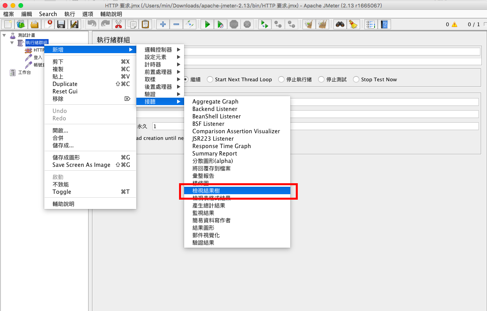

## 主題
使用JMeter模擬多人登入系統進行壓力測試

## 說明
壓力測試，不同於 apache bench，可進行模擬連續頁面的操作行為

當新系統完成時，可以使用JMeter模擬多人登入系統，並同時模擬多人操作系統中的各種功能，來測試系統最大同時上線的人數。

## 下載 apache jmeter

[jmeter](http://jmeter.apache.org/)

## 相關設定

1. 『測試計劃』項目上按右鍵新增Threads (Users)執行緒群組

2. 『執行緒數量』填上要模擬的人數，『啟動延遲(秒)』是幾秒內達到『執行緒數量』

3. 『執行緒群組』項目上按右鍵『設定元素』『HTTP Cookie管理員』

4. 『執行緒群組』項目上按右鍵新增取樣HTTP要求，這個設定是用來模擬使用者登入

5. 填入主機相關資料，包括主機IP、Post、協定、登入網頁路徑、登入參數

6. 『執行緒群組』項目上按右鍵新增取樣HTTP要求，這個設定是用來模擬使用者登入後，模擬使用者操作系統中的查詢功能

7. 填入主機相關資料，包括主機IP、Post、協定、查詢功能網頁路徑、查詢參數

8. 『執行緒群組』項目上按右鍵新增接聽檢視結果數，這個設定是用來觀看每次HTTP要求後的結果，可以用來驗證是否正確執行

9. 『執行緒群組』項目上按右鍵新增接聽彙整報告，這個設定是用來觀看每個HTTP要求的效能，可以查出那個HTTP要求的效能低落

## 『檢視結果樹』與『彙整報告』的使用

1. 執行進行模擬動作

2. 在『檢視結果樹』可以看到每個HTTP要求的回應

3. 在『彙整報告』可以看到每個HTTP要求的執行結果與效率
