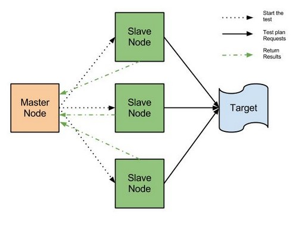
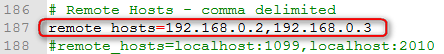
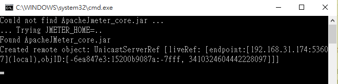
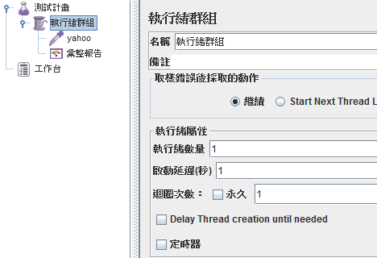
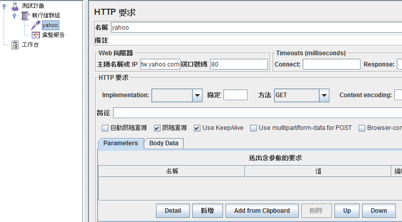
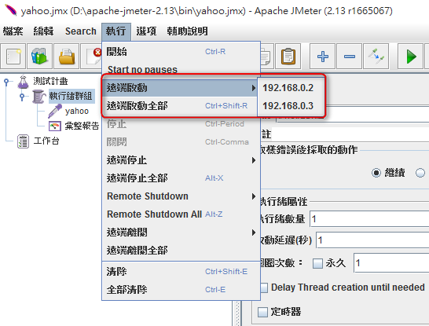
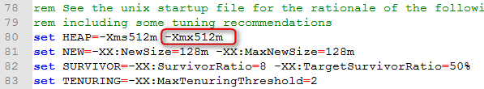
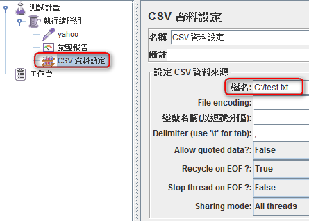

# 如何使用多台Server進行分散式壓測

## 前言
JMeter是當我們要針對特定系統進行壓力測試的時候很常使用到的工具，但有時候如果是需要大量壓力測試(大量執行緒)時，常常要壓測的系統還沒到達臨界值，JMeter自己本身會先OutOfMemory，為了改善此問題，本文將介紹如何使用多台電腦達到分散式壓測。

## 目的
使用JMeter建立分散式壓測環境，並說明需特別注意的重點。

## 開始前準備
本架構建立於JMeter 2.13的環境(以及Java6以上環境)，下載網址如下
取得後直接解壓縮即可

http://jmeter.apache.org/download_jmeter.cgi

## 架構說明
為了達成分散式壓測環境，首先我們要準備多台壓測電腦，並將其分為兩種不同的角色，
分別是Master Node以及Slave Node(以下簡稱Master & Slave)，Master負責設定所有的壓測設定(透過GUI)，Slave則是負責執行Master所交付的任務，並將壓測結果回傳給Master (如下圖所示)

## 設定調整
以下說明以Windows系統當作範例。負責當Master的電腦需調整jmeter.properties設定檔(位於`$JMeter_Home/bin`下)，找到remote_hosts選項，並修改為Slave的IP，有一台以上時以逗號隔開(範例中有兩台Slave)。

## 執行步驟

首先在所有的Slave Node電腦上執行 `$JMeter_Home/bin/jmeter-server.bat`，執行後會看到以下的執行視窗，代表Slave已經準備好接收Master的指令。

接著在Master的電腦上執行 `$JMeter_Home/bin/jmeter.bat`，並建立簡單的測試腳本如下

接著點選「執行」，此時會看到遠端啟動以及遠端啟動全部，這邊會有我們之前設定好的Slave清單，可以選擇只執行某一台，或者利用遠端啟動全部將所有Slave一起啟動，同時進行壓測。

## 注意事項

(1) 使用JMeter壓測時會需要使用到大量的記憶體，所以建議將各電腦的JMeter記憶體設定調高，不論Master、Slave都是調整$JMeter_Home/bin/jmeter.bat的HEAP參數。如下圖預設最大值為512M，可是電腦硬體配備來調整為適合的設定。需特別注意若設定為2g以上時必須要使用64位元版本的JDK，否則會啟動失敗。

(2) 當Master設定好相關的壓測數值時，代表所有的Slave都會依照此份設定執行，也就是說，如果使用以下的設定去執行時，兩台Slave都會各執行一次並將結果回傳，導致壓測的取樣數會依照Slave的數量成倍數成長(也就是說當有兩台Slave，且要模擬同時1000人壓測時，Master必須設定為500人才會是我們期望的壓測值)。

(3)若有使用CSV資料設定來取得不同的參數時，會指定該設定檔的檔名，此設定檔必須存在於所有的Slave電腦中(Slave無法取得Master的資料來源設定檔)，否則會出現找不到參數檔的錯誤。

## 參考來源

- JMeter Remote Testing－http://jmeter.apache.org/usermanual/remote-test.html