## 前言

此文件介紹Jmeter 2.8的效能測試軟體，主要是提供測試人員進行壓力測試及性能。並介紹Ultimate Thread Group 群組來模擬用戶使用時的高峰期，各功能的性能。最後針對幾項測試結果做介紹。

## 目的

- 幫助測試人員進一步的了解Jmeter 2.8 進行網站的效能測試。
- 了解到Ultimate Thread Group的使用方式。
- 了解測試結果的資料。

## 開始前準備

首先確定是否有Java環境及是否有安裝JDK，接著下載Jmeter (http://jmeter.apache.org/download_jmeter.cgi )，目前要介紹的版本為Jmeter 2.8，最新版本為2.13。 Jmeter無須安裝，下載後解壓縮即可使用。

## 建置Ultimate Thread Group

步驟一、新增一個新的Ultimate Thread Group  
(滑鼠右鍵 → 新增 → Threads(Users) → jp@gc - Ultimate Thread Group)

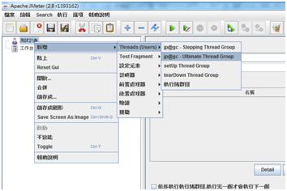

步驟二、修改名稱、增加備註欄 及選擇錯誤後採取的動作

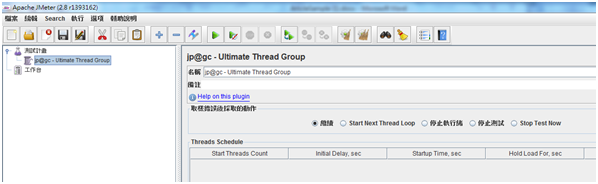

步驟三、接者點選 Add Row (新增列) ， 並修改程所需的數值。

欄位說明：  

- Start Threads Count：每次點擊的用戶數量，將開始一列接一列的執行。
- Initial Delay,sec ：延遲開始的時間。如果是第一列，表示一開始延遲開始的時間；其他列，表示延遲開始執行的時間。
- Startup Time ,sec ：啟動每個用戶間隔的時間（Start Threads Count / Startup Time），如下圖。 60 / 60意思是每個用戶點擊該功能間隔1秒，當開始執行時，會先延遲10秒後，第一位用戶將點擊測試的功能，並每隔1秒鐘每位用戶也將點擊該功能。
- Hold Load For ,sec ：該列持續執行的時間。
- Shutdown Time ：該秒內停止該列所有用戶。

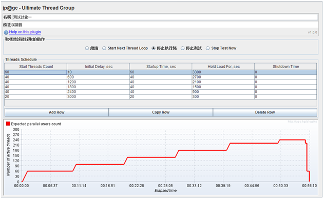

步驟四、新增效能測試功能  
(滑鼠右鍵 → 新增 → 取樣 → HTTP要求)

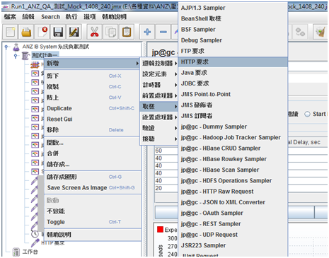

步驟五、設定HTTP要求，輸入所需的資料。以登入為例，如下圖。(PS.變數可以從路徑中輸入或下方參數要求 ) 接著新增依序新增所需功能。

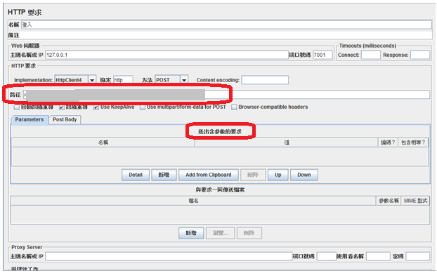

步驟六、新增測試結果報告
(滑鼠右鍵 → 新增 → 接聽 → 彙整報告)

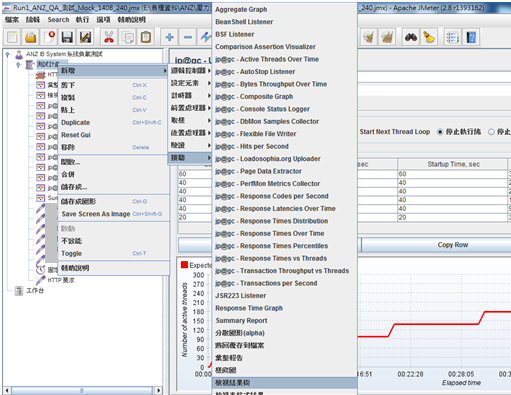

步驟七、設定彙整報告，修改名稱、增加備註及設定記錄檔來源，以便未來使用。  
接著依序新增：

- 檢視結果樹
- 檢視表格式結果
- Active Threads Over Time
- Bytes Throughput Over Time
- Composite Graph、Hits per Second
- Response Times Over Time
- Response Latencies Over Time
- Response Times vs Threads
- Transactions per Second
- Summary Report

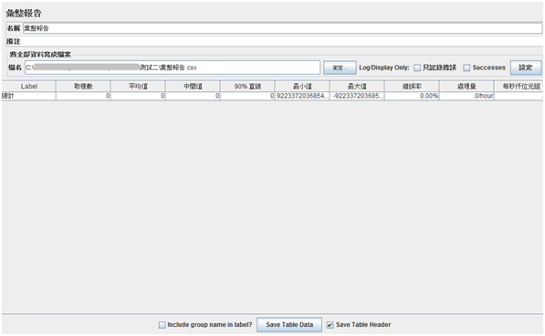

步驟八、執行壓力測試  
(選單執行→開始)

## 測試結果分析

檢視結果樹：可以檢視測試期間的資料成功與否及預覽該畫面。

檢視表格式結果：同檢視結果樹，以列表方式顯示測試期間的測試結果。

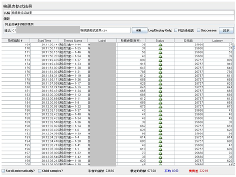

Active Threads Over Time：執行壓力測試期間的次數統計

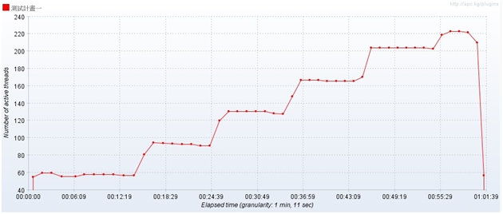

Bytes Throughput Over Time：執行壓力測試期間的發送和接收的資料量。

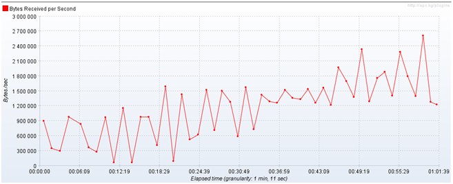

Composite Graph：此圖可以任選其他圖形，構成一張新的圖表，以利於做資料的比較。

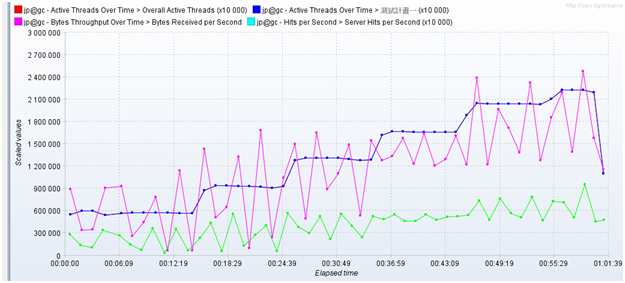

Hits per Second：顯示測試期間內，用戶點擊的數量。

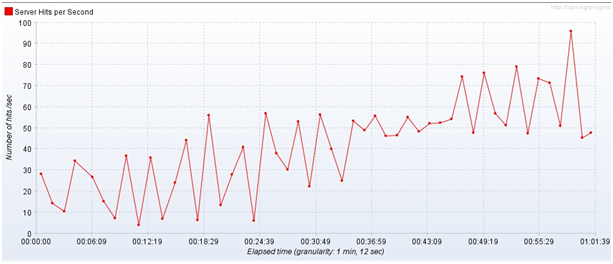

Response Times Over Time：平均反應時間，顯示測試期間內，隨著用戶數量的增加，所回應的平均時間。

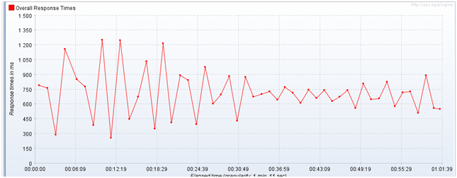

Response Latencies Over Time：顯示測試期間內，點擊後反應的延遲時間。

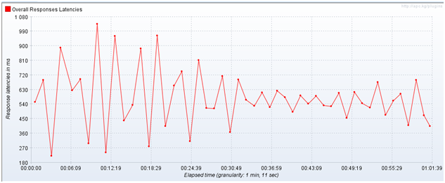

Response Latencies Over Time：顯示測試期間內，反應時間與各測試項目的數量變化。

Transactions per Second：測試執行期間處理量及錯誤數量。

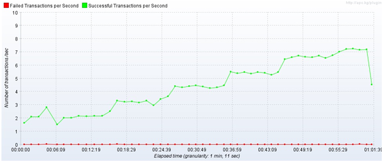

## 參考來源

- Ultimate Thread Group解說 ─ http://testingfreak.com/jmeter/ultimate-thread-group/
- 測試結果分析 ─ http://www.cnblogs.com/Carrie_Liang/archive/2008/11/10/1330997.html
- 測試結果分析 ─ http://jmeter-plugins.org/wiki/Start/