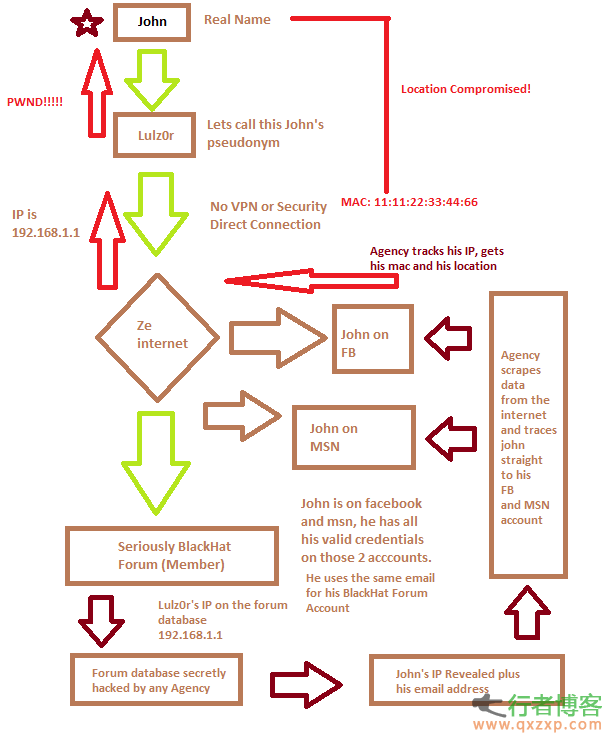
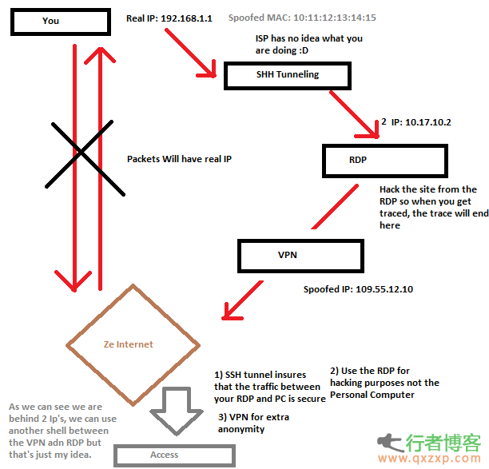

# 如何正確隱藏自己的行蹤

通常一般人註冊某個黑客網站，會透過某些明碼進行註冊，如此一來網站就知道你的

- 註冊名稱
- 大頭貼
- ip
- mac address
- mail

通常會犯的錯誤

1. 因為直接從網路連到該論壇，若用了 代理 ，則 hacker 無法容易找到此人
2. mac address，黑客可以利用 mac address 來定位你，mac address 可以用來追蹤及定位丟失的電腦。

如何在入侵時，保持『匿名』？

1. 變換 mac address
	- [linux](http://www.perturb.org/display/549_Spoofing_a_MAC_address_on_Linux.html)
	- [windows](http://www.hackcommunity.com/Thread-Mac-Address-Spoofing-Tutorial)
	- 為何需要變更 mac address，[相關文章](http://www.ciscozine.com/2011/01/12/how-to-trace-mac-address/)

2. 不留痕跡
	- [銷毀工具](http://www.dban.org/)：用這個來銷毀你的硬盤，這樣你就不會留下任何痕跡了，這個反取證工具內置在Backtrack 5 R3，可能也在Kail Linux中